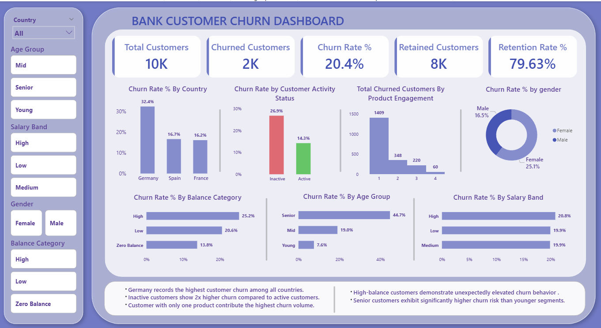

# Bank Customer Churn Analysis

## Project Overview
This project focuses on analyzing customer churn behavior in a banking environment using Excel, SQL, and Power BI. 
The objective was to identify key factors influencing customer attrition and generate actionable business insights through interactive visualizations and data-driven analysis.

## Dashboard Overview

## Problem Statement

Customer churn is one of the biggest challenges for banks, as losing existing customers directly impacts profitability and long-term growth.

The organization needed to understand:
- Which customer segments are more likely to churn
- How customer activity impacts retention
- Whether balance, age, gender, or product engagement influence churn behavior
- Which customer groups require retention-focused strategies

The goal was to transform raw customer data into meaningful insights that support better customer retention decisions.

## Data Summary

The dataset contains approximately **10,000 customer records** with multiple banking-related attributes.

### Key Columns
- Customer ID
- Credit Score
- Country
- Gender
- Age
- Balance
- Estimated Salary
- Number of Products
- Credit Card Status
- Active Member Status
- Churn Status

# Tech Stack

- Microsoft Excel : Data Cleaning & Preparation 
- Power Query : Data Transformation
- MySQL : Exploratory Data Analysis
- Power BI : Dashboard Development 
- DAX : KPI Calculations & Measures 

## Project Workflow

### Data Cleaning & Preparation
Performed data preprocessing using Excel and Power Query:
- Created Age Group categories
- Created Salary Band segmentation
- Created Balance Categories
- Created Active/Inactive customer status
- Structured data for SQL and Power BI analysis

### SQL Analysis
Performed exploratory data analysis using MySQL to identify churn patterns.

### Analysis Performed
- Churn Rate by Country
- Customer Activity vs Churn
- Product Engagement vs Churn
- Balance Category Impact
- Age Group Analysis
- Gender-Based Churn Trends
- Retention Rate Calculation

###  Power BI Dashboard
Developed an interactive and business-focused dashboard with:
- KPI Cards
- Dynamic Slicers
- Behavioral Churn Analysis
- Customer Segmentation Insights
- Interactive Visualizations
- Glassmorphism-inspired UI Design

## Key Business Insights

- Customers with only one product contributed the highest churn volume.
- Inactive customers showed nearly 2x higher churn compared to active customers.
- Germany recorded the highest customer churn rate among all countries.
- High-balance customers demonstrated unexpectedly high churn behavior.
- Senior customers exhibited significantly higher churn risk than younger segments.

## KPI Metrics

The dashboard includes:
- Total Customers
- Churned Customers
- Retained Customers
- Churn Rate %
- Retention Rate %

## Dashboard Features

- Soft professional UI theme
- Glassmorphism-style KPI cards
- Interactive filtering experience
- Clean and modern dashboard layout
- Business-oriented visual storytelling

# Conclusion

This project demonstrates how data analytics can be used to identify customer retention risks and uncover behavioral churn patterns in the banking sector.

By combining Excel, SQL, and Power BI, the project transformed raw customer data into actionable insights that can support:
- Customer retention strategies
- Customer engagement improvement
- Risk identification
- Data-driven decision making

## Recommendations

- Focus on re-engaging inactive customers through personalized offers and retention campaigns.
- Encourage single-product customers to adopt additional banking services to improve customer retention.
- Improve premium customer experience, as high-balance customers showed elevated churn behavior.
- Develop targeted retention strategies for high-risk customer segments identified through demographic analysis.
- Use customer activity and product engagement metrics as early indicators for churn prediction and prevention.
  
# Project Outcome

This project showcases:
- Data Cleaning
- SQL-Based Analysis
- KPI Development
- Dashboard Design
- Business Intelligence Reporting
- Analytical Storytelling

